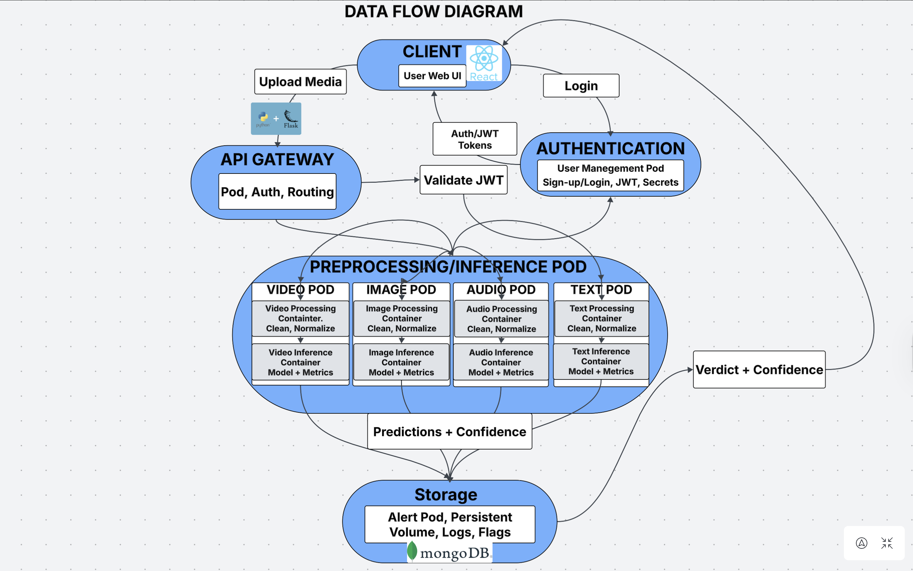

##  

## Table of Contents
- [Overview](#Overview)
- [Features](#features)
- [Architecture](#architecture-diagram)
- [Tech-Stack](#tech-stack)
- [Installation-&-Running-Instructions](#installation--running-instructions)
- [Contributors](#contributors)

## Overview 
The **Deepfake & Synthetic Media Detector** is a cloud-native, Kubernetes-based application designed to detect AI-generated or manipulated content across multiple media types: 
- Text
- Audio
- Image
- Video

The system integrates a React frontend, a Flask API backend, and distributed microservices for preprocessing, inference, persistence (via mongoDB), and authentication.

## Features
- Upload and analyze text, image, audio, or video files.
- Multi-model inference pipeline (per media type).
- JWT-secured authentication and user account system.
- Persistent history and storage quotas per user.
- React frontend with Flask API backend.
- Kubernetes microservices with autoscaling.
- MongoDB for results, metadata, and user data.
- Daily backup & failover support.

## Architecture 

The system follows a distributed microservice architecture.

**Core Components**
- React Frontend — user upload, authentication, dashboard.
- Flask API Gateway — main entry point, upload routing, JWT auth.
- Preprocessing Service — converts and normalizes input.
- Inference Service (multi-container):
   - text model
   - audio model
   - image model
   - video model
   - logging sidecar
- User Management Service — registration, login, token issuance.
- MongoDB StatefulSet — metadata, history, users.
- PVC Storage — raw files, logs.

## Tech Stack
- Frontend: React
- Backend: Flask (Python)
- Database: MongoDB
- Cloud Platform: Kubernetes (K8s)
- Storage: PVCs, dynamic provisioning
- Auth: JWT
- Languages: Python, JavaScript
- Build/Deploy: Docker, CI/CD (if added later)

## Installation & Running Instructions

## Api Endpoints
**Authentication**

POST/auth/register
Registers a new user.

POST/auth/login
Returns a JWT and expiration time.

**File Upload**

POST/upload (JWT required)
Uploads a file for processing.
Respose: job_id + processing status.

**Results**

GET/result/{job_id}
Returns classification + confidence.

GET/history
Returns stored inference history.

DELETE/history/clear
Clears user's stored results.

## Contributors
- Kevin Ha
- Isreal Adegbie
- Thomas Burke
- Mo Abdularazzak